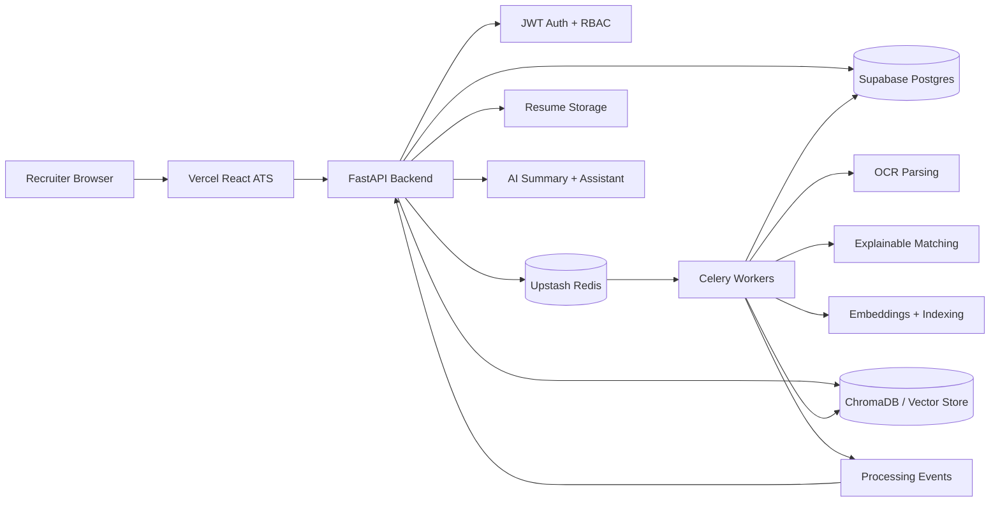

# AI ATS Productization Plan

This document is the product pivot for the project. Deep runtime/orchestration evolution should stop for now. The backend is already strong enough; the next phase is to turn it into a polished, deployable recruiter-facing AI ATS.

## Product Direction

Build a practical AI recruitment SaaS for small hiring teams:

- Recruiters upload resumes against a job description.
- The system parses, ranks, explains, and summarizes candidates.
- Recruiters move candidates through a hiring pipeline.
- Interviews are prepared, scored, and summarized in one workspace.
- Admins manage users, roles, integrations, and demo data.

Runtime internals such as chaos experiments, adaptive DAG mutation, consensus agents, simulations, predictive queue policy, and workflow evolution should remain backend-only implementation depth. They should not be foregrounded in the main recruiter UI.

## 1. Complete Frontend Architecture

Use a new React app under `frontend/ats` and keep the current static frontend as a legacy fallback until the React app is stable.

```text
Vite React TypeScript app
  -> React Router route tree
  -> shadcn/ui component system
  -> Tailwind design tokens
  -> TanStack Query API cache/mutations
  -> Auth provider with JWT persistence
  -> Role-aware route guards
  -> Recharts analytics visualizations
  -> EventSource/polling processing progress layer
  -> API client wrapping FastAPI endpoints
```

Key decisions:

- Use `access_token` from `/auth/login` as a bearer token.
- Store token in memory plus `localStorage` for college-demo convenience.
- Put API state in TanStack Query, not component-local fetch calls.
- Keep complex pages composed from reusable ATS modules: tables, scorecards, timelines, candidate panels, upload queue, assistant drawer.
- Keep orchestration/runtime routes out of navigation except a small admin health card.

## 2. Frontend Folder Structure

```text
frontend/ats/
  index.html
  package.json
  vite.config.ts
  tsconfig.json
  tailwind.config.ts
  postcss.config.js
  src/
    main.tsx
    app/
      App.tsx
      router.tsx
      providers.tsx
      queryClient.ts
    api/
      client.ts
      auth.ts
      resumes.ts
      processing.ts
      jobs.ts
      interviews.ts
      analytics.ts
      assistant.ts
      admin.ts
      types.ts
    auth/
      AuthProvider.tsx
      RequireAuth.tsx
      RequireRole.tsx
      useAuth.ts
    components/
      layout/
        AppShell.tsx
        Sidebar.tsx
        Topbar.tsx
        ThemeToggle.tsx
        MobileNav.tsx
      candidates/
        CandidateTable.tsx
        CandidateCard.tsx
        CandidateStageBadge.tsx
        CandidateFilters.tsx
        CandidateProfileHeader.tsx
        CandidateTimeline.tsx
      ai/
        AISummaryPanel.tsx
        MatchExplanationPanel.tsx
        SemanticMatchChart.tsx
        EvidenceList.tsx
      uploads/
        ResumeDropzone.tsx
        UploadProgressList.tsx
        ProcessingTimeline.tsx
      interviews/
        InterviewQuestionCard.tsx
        InterviewScorecard.tsx
        InterviewAnswerForm.tsx
      jobs/
        JobForm.tsx
        JobList.tsx
        JobDetailDrawer.tsx
      pipeline/
        PipelineKanban.tsx
        PipelineColumn.tsx
      assistant/
        AssistantChat.tsx
        AssistantReferences.tsx
      analytics/
        FunnelChart.tsx
        ScoreDistribution.tsx
        TimeToShortlistChart.tsx
      ui/
        shadcn components
    pages/
      LoginPage.tsx
      RegisterPage.tsx
      DashboardPage.tsx
      UploadPage.tsx
      CandidatesPage.tsx
      CandidateProfilePage.tsx
      ResumeViewerPage.tsx
      JobsPage.tsx
      RankingPage.tsx
      InterviewWorkspacePage.tsx
      AnalyticsPage.tsx
      AssistantPage.tsx
      PipelinePage.tsx
      AdminSettingsPage.tsx
    lib/
      cn.ts
      format.ts
      permissions.ts
      constants.ts
    styles/
      globals.css
```

## 3. ATS UI/UX Design

Design tone: modern recruiter operations product, not a marketing site.

- Layout: left sidebar, top command/search area, dense content canvas.
- Visual style: quiet neutral surface, high-contrast typography, restrained accent colors for match score and hiring stages.
- Cards: use only for individual candidate/AI/status modules, not nested page sections.
- Navigation: Dashboard, Upload, Candidates, Jobs, Ranking, Pipeline, Interviews, Analytics, Assistant, Admin.
- Primary actions: Upload resumes, Create job, Rank candidates, Start interview, Move stage.
- AI visibility: every AI output should show confidence, evidence, and "why this matters" in recruiter language.

## 4. Dashboard Layout

The dashboard should answer "what needs my attention today?"

Top row:

- Active jobs
- Candidates processed
- Average match score
- Interviews pending
- Failed processing jobs

Main area:

- Recent uploads with live status
- Top candidates for the selected job
- Pipeline funnel chart
- Recruiter activity timeline

Right rail:

- AI assistant quick prompt
- Integration status
- Demo seed/reset controls for presentation mode

## 5. Component Hierarchy

```text
App
  Providers
    AuthProvider
    QueryClientProvider
    ThemeProvider
    RouterProvider
      PublicAuthLayout
        LoginPage
        RegisterPage
      RequireAuth
        AppShell
          Sidebar
          Topbar
          RoutedPage
            DashboardPage
            UploadPage
            CandidatesPage
            CandidateProfilePage
              CandidateProfileHeader
              ResumeViewer
              MatchExplanationPanel
              AISummaryPanel
              CandidateTimeline
            PipelinePage
              PipelineKanban
            InterviewWorkspacePage
              InterviewScorecard
            AnalyticsPage
              Recharts modules
            AdminSettingsPage
```

## 6. API Integration Strategy

Wrap all API calls in typed modules:

- `auth.ts`: `/auth/login`, `/auth/register`
- `resumes.ts`: `/resumes`, `/resumes/search`, `/resumes/{id}`, `/resumes/stats`
- `processing.ts`: `/processing/resumes/upload`, `/processing/jobs`, `/processing/jobs/{id}`, `/processing/jobs/{id}/events`, `/processing/jobs/{id}/stream`
- `jobs.ts`: `/features/jobs`, `/features/templates`
- `pipeline.ts`: `/features/resumes/{id}/stage`, `/features/resumes/bulk`
- `ai.ts`: `/features/resumes/{id}/ai-summary`, `/features/semantic-retrieve`
- `assistant.ts`: `/features/recruiter-assistant/query`
- `interviews.ts`: `/features/resumes/{id}/interview/start`, `/features/interviews/{id}`, `/features/interviews/{id}/answer`
- `analytics.ts`: `/features/analytics/funnel`, `/features/analytics/time-to-shortlist`
- `admin.ts`: `/features/admin/users`, `/features/team/summary`, `/features/integrations/status`

TanStack Query keys:

```text
["me"]
["resumes", filters]
["resume", resumeId]
["processingJobs", filters]
["processingJob", jobId]
["processingEvents", jobId]
["jobs"]
["job", jobId]
["candidateAiSummary", resumeId]
["assistant", conversationId]
["interview", sessionId]
["analytics", "funnel"]
["analytics", "timeToShortlist"]
["admin", "users"]
```

## 7. Authentication Flow

Login/register:

1. User submits email/password.
2. Frontend calls `/auth/login` or `/auth/register`.
3. Register success redirects to login or auto-login by calling `/auth/login`.
4. Login stores `access_token`.
5. API client attaches `Authorization: Bearer <token>`.
6. `401` clears token and redirects to `/login`.

Recommended backend addition:

- Add `GET /auth/me` returning `id`, `email`, `full_name`, `role`, `is_active`.

## 8. RBAC Design

Current roles: `recruiter`, `admin`.

Recruiter can:

- Manage their jobs and resumes.
- Upload resumes.
- View rankings, explanations, summaries, interviews, analytics for owned data.
- Move candidates through pipeline.
- Use recruiter assistant.

Admin can:

- Do everything recruiter can.
- View team summary.
- List users.
- Change roles.
- View integration status.
- Seed/reset demo data.

Frontend enforcement:

- `RequireRole allowed={["admin"]}` for Admin Settings.
- Hide admin nav items for recruiters.
- Show disabled explanation if a recruiter reaches an admin URL.

Backend hardening:

- Centralize `require_role("admin")`.
- Add team/account ownership if multi-recruiter shared workspaces are required.
- Keep file access scoped by owner/team.

## 9. Responsive Design Strategy

Desktop:

- Persistent sidebar.
- Two-column candidate profile: resume viewer left, AI/decision panels right.
- Dense tables with sticky headers and column controls.

Tablet:

- Collapsible sidebar.
- Candidate profile becomes stacked tabs: Overview, Resume, AI Match, Interview, Activity.

Mobile:

- Bottom navigation or drawer navigation.
- Tables switch to candidate cards.
- Kanban becomes horizontally scrollable columns.
- Upload page stays simple: job selector, dropzone, status list.

## 10. Realtime Progress UI

Upload UX:

1. Recruiter selects a job/JD.
2. Drag/drop resumes.
3. Frontend posts to `/processing/resumes/upload`.
4. Response returns processing jobs.
5. UI renders each resume as a progress row.
6. Subscribe to `/processing/jobs/{id}/stream` with `EventSource` when available.
7. Fallback to polling `/processing/jobs/{id}` every 1-2 seconds.
8. Load `/processing/jobs/{id}/events` for a detailed timeline.

Timeline steps:

```text
Queued -> Parsing -> OCR if needed -> Skill extraction -> Match scoring -> Embedding -> AI summary -> Complete
```

Status states:

- Queued: gray
- Running: blue progress
- Retrying: amber
- Failed: red with retry/replay action for admin
- Completed: green with "View candidate"

## 11. Candidate Workflow UX

Candidate list:

- Search by name/email/skills.
- Filter by job, stage, match range, tags, assigned recruiter, starred.
- Sort by final score, match score, interview score, upload date.
- Bulk actions: shortlist, reject, move stage, assign, star, export CSV.

Candidate profile:

- Header: name, role match, stage, score, contact, tags.
- Left: resume viewer and parsed text.
- Right: AI summary, match explanation, missing skills, evidence snippets.
- Bottom: activity timeline, notes, interview history.

Pipeline:

- Kanban columns: New, Screened, Shortlisted, Interview, Offer, Rejected.
- Drag/drop stage updates call `/features/resumes/{id}/stage`.
- Candidate cards show score, job, tags, assigned recruiter, next action.

## 12. Interview Workflow UX

Interview workspace:

- Select candidate and job.
- Start session with `/features/resumes/{id}/interview/start`.
- Show generated question, expected skills, difficulty, and answer form.
- Submit text/transcript to `/features/interviews/{session_id}/answer`.
- Scorecard updates after each answer.
- Final panel shows average score, recommendation, strengths, concerns, and next step.

UX modules:

- Question queue
- Current answer editor
- Matched keyword chips
- Difficulty trend
- Score by answer
- Finalize selection action

## 13. Analytics Dashboard Design

Charts with Recharts:

- Pipeline funnel by stage from `/features/analytics/funnel`.
- Time to shortlist from `/features/analytics/time-to-shortlist`.
- Match score distribution from `/resumes`.
- Candidate source/upload trend from resume dates.
- Interview score vs match score scatter.
- Top missing skills across candidates by parsing `missing_skills`.

Recruiter-friendly insights:

- "Most candidates are dropping before interview."
- "React and AWS are the most common missing skills."
- "Top 5 candidates are ready for outreach."

## 14. Deployment Architecture

```text
Vercel
  React/Vite frontend
  VITE_API_BASE_URL=https://api.example.com

Render/Fly.io/Railway
  FastAPI API container
  Celery worker container
  Optional dedicated OCR/AI worker process

Supabase Postgres
  SQLModel/Alembic database

Upstash Redis
  Celery broker/result backend
  Processing event stream support when enabled

Persistent storage
  Local volume for Render/Fly demo
  Later: S3-compatible object storage for resumes
```

Architecture diagram for README/presentation:



## 15. Docker Deployment Setup

Production containers:

- `api`: runs Alembic migrations then starts FastAPI.
- `worker`: starts Celery worker for default/bulk/ai/embedding/ocr queues.
- `redis`: local only; production uses Upstash.
- `postgres`: local only; production uses Supabase.

Recommended commands:

```bash
docker compose up --build
docker compose exec api alembic upgrade head
```

Production image should:

- Install only runtime Python dependencies.
- Set `AUTO_DB_BOOTSTRAP=false`.
- Use `DATABASE_URL` from Supabase.
- Use `CELERY_BROKER_URL` and `CELERY_RESULT_BACKEND` from Upstash.
- Expose `/healthz` and `/readyz`.

## 16. Production Environment Setup

Frontend `.env.production`:

```text
VITE_API_BASE_URL=https://your-backend-url
VITE_APP_NAME=AI Recruiter ATS
VITE_DEMO_MODE=true
```

Backend production env:

```text
DATABASE_URL=postgresql+psycopg://...
JWT_SECRET_KEY=<strong-secret>
AUTO_DB_BOOTSTRAP=false
UPLOAD_DIR=/app/uploads
CORS_ORIGINS=https://your-vercel-app.vercel.app
REDIS_URL=rediss://...
CELERY_BROKER_URL=rediss://...
CELERY_RESULT_BACKEND=rediss://...
OPENAI_API_KEY=<optional>
OPENAI_MODEL=gpt-4o-mini
MATCHER_DISABLE_EMBEDDINGS=false
PROCESSING_EVENT_REDIS_ENABLED=true
AUTONOMOUS_RUNTIME_ENABLE=false
CHAOS_EXPERIMENTS_ENABLE=false
```

Deployment readiness checklist:

- Health endpoints pass.
- CORS includes deployed frontend.
- JWT secret is not default.
- Upload size is capped.
- API errors use the standard envelope.
- Worker starts successfully.
- Demo seed works.
- README has local and deployed demo instructions.

## 17. GitHub README Structure

Recommended README:

```text
# AI Recruiter ATS

Short product pitch
Demo GIF/screenshot
Live demo links

## Features
Recruiter dashboard
Resume parsing/OCR
AI candidate summaries
Explainable matching
Semantic retrieval
Adaptive interview workspace
Pipeline Kanban
Analytics
RBAC/admin
Async processing

## Architecture
Diagram
Frontend stack
Backend stack
Data/worker flow

## Demo Flow
Seed data
Login
Create job
Upload resumes
Rank candidates
Open candidate profile
Ask assistant
Run interview
Move pipeline stage
View analytics

## Local Setup
Backend
Frontend
Celery/Redis
Tests

## Deployment
Vercel
Render/Fly/Railway
Supabase
Upstash

## API Overview
Auth
Resumes
Processing
Jobs
AI
Interviews
Analytics
Admin

## Resume/Portfolio Notes
What makes it impressive
```

## 18. Demo Script

Five-minute demo:

1. Open dashboard and explain: "This is an AI ATS for recruiters to process resumes, rank candidates, and run interviews."
2. Login as recruiter.
3. Create or select a Software Engineer job description.
4. Upload 3-5 resumes and show live processing progress.
5. Open Candidate Ranking and sort by match score.
6. Open the top candidate profile.
7. Show resume viewer, AI summary, match explanation, matched/missing skills, and evidence snippets.
8. Ask the assistant: "Which candidates are strongest for React and backend APIs?"
9. Move candidate to Shortlisted in Kanban.
10. Start interview workspace and submit one answer.
11. Show scorecard and final recommendation.
12. Open analytics and explain hiring funnel.
13. Close with deployment architecture: Vercel frontend, FastAPI workers, Supabase Postgres, Upstash Redis.

Backup demo mode:

- Use `/features/demo/seed` before recording.
- Keep deterministic fallback AI enabled for no-key environments.
- Use screenshots if worker deployment is sleeping.

## Demo Screenshots

Capture these for GitHub and college presentation:

- Login screen with polished branding.
- Recruiter dashboard with KPI cards and recent processing activity.
- Resume upload page with progress timeline.
- Candidate ranking table with match scores.
- Candidate profile with resume viewer, AI summary, and explanation panel.
- Pipeline Kanban with candidates in stages.
- Interview workspace with scorecard.
- Analytics dashboard with funnel and charts.
- Recruiter assistant answer with candidate references.
- Admin settings with user roles and integration status.

## Demo Video Outline

Target length: 90-150 seconds.

```text
0:00 - Product title and one-line value proposition
0:10 - Login and dashboard overview
0:25 - Upload resumes for a job
0:45 - Show live processing and ranking
1:05 - Open candidate profile and explain AI summary/match evidence
1:30 - Ask recruiter assistant a candidate question
1:50 - Move candidate through pipeline
2:05 - Show interview scorecard and analytics
2:20 - End on architecture/deployment slide
```

## College Presentation Structure

```text
Slide 1: Problem - recruiters manually screen many resumes
Slide 2: Solution - AI ATS for parsing, matching, ranking, and interviews
Slide 3: User workflow - upload, rank, explain, interview, shortlist
Slide 4: Architecture - React, FastAPI, Celery, Redis, Postgres, vector search
Slide 5: AI features - summaries, semantic retrieval, explanations, interviews
Slide 6: Security/product - JWT, RBAC, file validation, health checks
Slide 7: Demo screenshots
Slide 8: Deployment - Vercel, Render/Fly/Railway, Supabase, Upstash
Slide 9: What I learned - product engineering, async systems, UX, AI integration
Slide 10: Future scope - team accounts, object storage, email/calendar integrations
```

## 19. LinkedIn Project Description

Built an AI-powered Applicant Tracking System for recruiters using React, TypeScript, FastAPI, Celery, Redis, and semantic search. The platform supports resume upload, OCR parsing, explainable job matching, AI candidate summaries, semantic candidate retrieval, adaptive interview scoring, pipeline Kanban, recruiter analytics, JWT authentication, RBAC, and Docker-ready deployment. Focused on turning an advanced AI backend into a polished recruiter-facing SaaS product with a smooth end-to-end demo workflow.

## 20. Resume Project Description

AI Recruiter ATS | React, TypeScript, FastAPI, Celery, Redis, PostgreSQL, ChromaDB

- Built a recruiter-facing ATS that parses resumes, extracts skills, ranks candidates against job descriptions, and explains match decisions.
- Implemented AI candidate summaries, semantic resume retrieval, adaptive interview scoring, pipeline management, analytics, JWT authentication, and role-based admin controls.
- Designed async processing with FastAPI, Celery, Redis, OCR parsing, vector embeddings, and replayable job status tracking for scalable resume workflows.
- Productized the system with a modern React dashboard, live upload progress, searchable candidate tables, Kanban pipeline, deployment configs, API docs, and demo-ready seed data.

## Practical Build Order

Phase 1: React foundation

- Create Vite React TypeScript app.
- Add Tailwind, shadcn/ui, router, query client, auth provider.
- Implement login/register and protected app shell.

Phase 2: Recruiter core workflow

- Upload page with job selector and progress timeline.
- Candidate list with filters/search.
- Candidate profile with resume viewer, AI summary, and match explanation.
- Job management.

Phase 3: Product polish

- Ranking screen.
- Kanban pipeline.
- Interview workspace.
- Analytics dashboard.
- Assistant chat.
- Dark/light mode.

Phase 4: Deployment/demo

- Production env templates.
- Vercel config.
- Backend deployment notes.
- README rewrite.
- Architecture diagram.
- Screenshots and demo video script.

## Scope Guardrails

Do now:

- Build the recruiter UI.
- Stabilize auth/RBAC and deployment.
- Make AI features legible.
- Improve README, screenshots, and presentation.

Avoid for now:

- New runtime agents.
- More orchestration policies.
- More predictive/autonomous queue research.
- More workflow mutation features.
- New backend complexity unless directly needed by the recruiter product.
